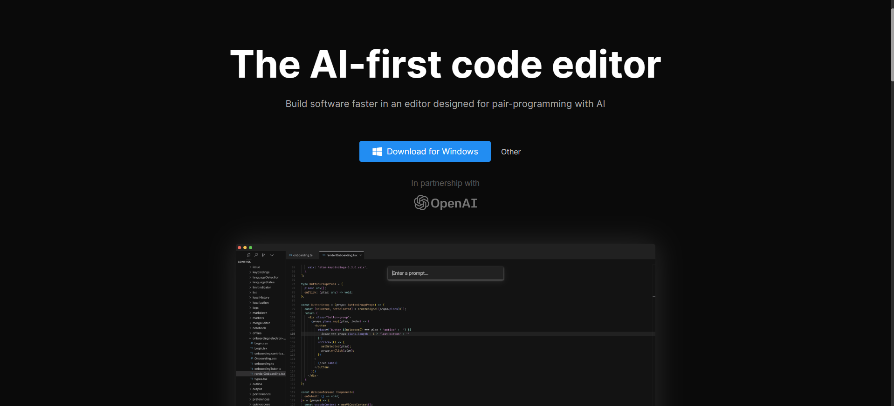

# Cursor 代码辅助AI

> 这是一款与OpenAI合作并且基于GPT4的新一代辅助编程神器。
>
> 它支持多种文件类型，支持格式化文本，支持多种主题，支持多语言语法高亮，支持快捷键设置，支持代码折叠、括号匹配、自动缩进等功能等功能。

### 1.Cursor编辑器下载

可以直接官方网站下载：[https://www.cursor.so/]

### 2.Cursor操作指南

操作特别简单，只需要记住两个快捷键就行：

Windows 平台：

> Ctrl+K : 智能生成代码
> Ctrl+L: 询问代码含义  （如果回答英文，对AI说用中文回答即可）

Mac 平台：

> Command+K : 智能生成代码
> Command+L: 询问代码含义

打开一个文件，比如main.js，然后摁下快捷键 Ctrl+K，在提示框中输入你想要生成的代码，回车即可

生成代码如下，假设你对第 25 行代码不理解，可以选中这行代码，然后快捷键 Ctrl+L,询问代码含义

这样就可以得到你想生成的代码了。