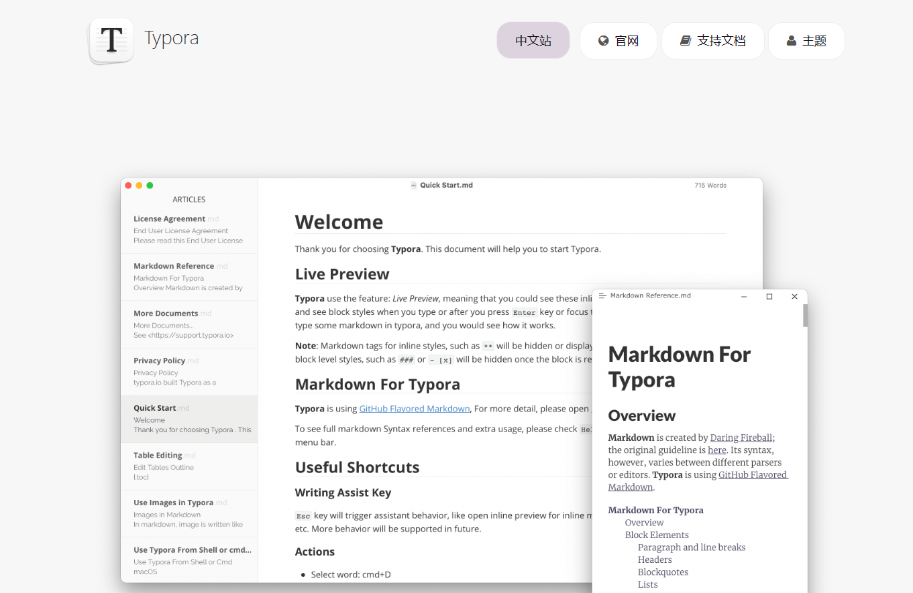

# TYPORA的使用手册

​       

------

Typora 一直是我认为桌面端笔记应用应有的终极形态。「它的**功能之强大、设计之冷静、体验之美妙、理念之先进** 」。但一件很尴尬的事情是，由于它极简的设计理念，有许多使用者并没能完全地了解到 Typora 的全部强大功能。在这篇文章中由浅入深地介绍 Typora 的功能亮点。无论从未用过 Typora，还是已经体验了很久，相信都能在这篇文章中发现 Typora 新的惊喜。

   Typora 是一款**支持实时预览的 Markdown 文本编辑器**。它有 OS X、Windows、Linux 三个平台的版本，并且由于仍在测试中，是**完全免费**的。

> 下文附带安装包
>

## 一个 Markdown 文本编辑器🔥

------

​        Typora 首先是一个 Markdown 文本编辑器，它支持且仅支持 Markdown 语法的文本编辑。在 Typora 官网 上他们将 Typora 描述为 「A truly **minimal** markdown editor. 」。

#### 关于markdown

​        Markdown 是用来编写结构化文档的一种纯文本格式，它使我们在双手不离开键盘的情况下，可以对文本进行一定程度的格式排版。你可以在 这篇文章 中快速入门 Markdown。

​        由于目前还没有一个权威机构对 Markdown 的语法进行规范，各应用厂商制作时遵循的 Markdown 语法也是不尽相同的。其中比较受到认可的是 GFM 标准，它是由著名代码托管网站 GitHub 所制定的。Typora 主要使用的也是 GFM 标准。同时，你还可以在 `文件 - 偏好设置 - Markdown 语法偏好 - 严格模式` 中将标准设置为「更严格地遵循 GFM 标准」。具体内容你可以在官方的 这篇文档 中查看。 一个文本编辑器，**写得舒服**是关键。「更有趣的是，一个笔记应用不会因为它支持 Markdown 语法而高级或易用很多。」，细枝末节处的人性化考虑才是最重要的。而 Typora 的编辑体验显然是经过深思熟虑设计的产物。

   我认为：一个优秀的笔记应用应该给用户**选择 Markdown 语法风格的权利**。而 Typora 在这一点上是我目前见过所有 Markdown 笔记应用中做得最好的。

------

### 常用的MarkDown的语法格式

最常见的快捷键设置

1. **安装和启动Typora**：

   - 访问Typora官方网站（https://www.typora.io/）并下载适用于您的操作系统的安装程序。
   - 完成安装后，启动Typora应用程序。

2. **创建新文档：**

   - 在Typora中，您可以通过单击菜单栏上的"文件"，然后选择"新建"来创建一个新的空白文档。
   - 或者，您也可以使用快捷键Ctrl + N（Windows）或Cmd + N（Mac）创建新文档。

3. **编写和格式化文本：**

   - 在Typora的编辑区域，您可以像在普通文本编辑器中一样直接开始键入内容。
   - 您可以使用常见的键盘快捷键（如Ctrl + B、Ctrl + I和Ctrl + U）来添加粗体、斜体和下划线等基本格式。
   - 若要创建标题、列表、引用等特殊格式，请使用Typora的Markdown语法。 例如，使用"# "来创建一级标题，使用"* "或"- "来创建无序列表。

4. **插入图片：**

   - 您可以通过拖放图片文件到Typora的编辑区域来插入图片。
   - 或者，您可以使用快捷键Ctrl + Shift + I（Windows）或Cmd + Shift + I（Mac）来插入图片。
   - 插入的图片将被自动上传到Typora中，您可以调整图片大小、添加标题等。

5. **导出文档：**

   - Typora支持将文档导出为多种格式，如HTML、PDF、Markdown和纯文本等。
   - 要导出文档，请单击菜单栏中的"文件"，然后选择"导出"。 选择所需的导出格式并指定保存位置。

   

这只是Typora的基本使用教程，您可以通过探索Typora的其他功能和选项来进一步了解它。 Typora提供了丰富的编辑和格式化选项，以及更多高级功能，如表格、公式等。 希望这个简要的教程能够帮助您开始使用Typora，并轻松编写和编辑您的文档！

------

### Typora安装包免费版🔥

> **链接：https://pan.baidu.com/s/1P2X0_86wXTCm63jzdakhaw** 
>
> **提取码：deng**

